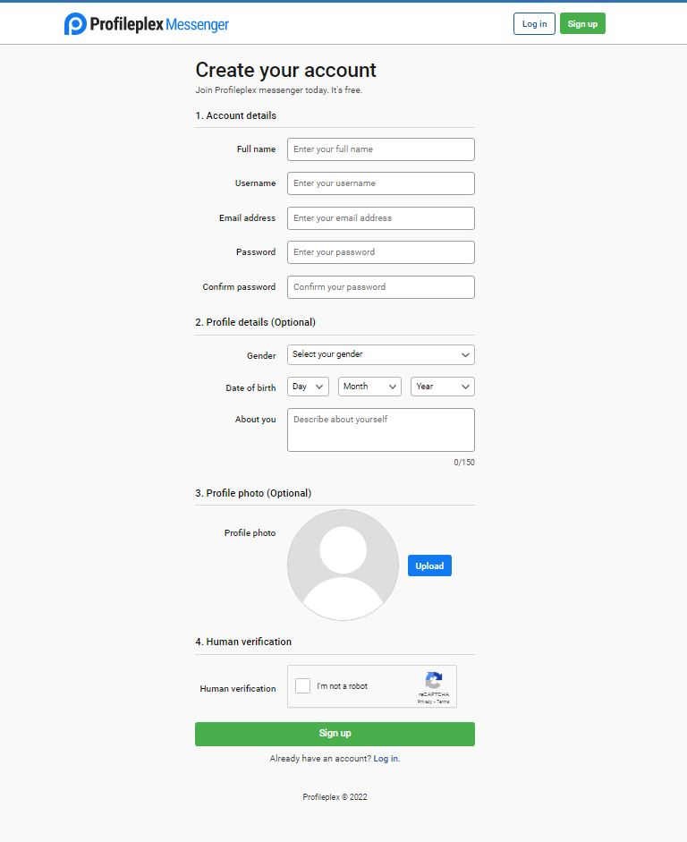

# Profileplex Messenger
Profileplex Messenger is a web-based chat application created by using HTML5, CSS3, plex.css(created custom CSS framework), jQuery, PHP (Codeigniter framework) and MySQL. The main idea behind this is to provide real-time instant messaging to users. Profileplex Messenger is using End-to-End encryption so no any third-person can see any private information. emojis support and voice-to-text feature is also included.
# Screenshots

